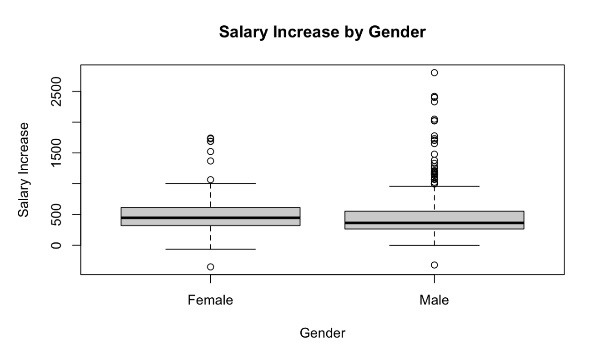

In our last post, we looked at starting salaries. But now, what happens if a professor moves up the career ladder? Today, we are looking at one of the most important moments in a professor's career: the promotion from Associate Professor to Full Professor.

When this promotion happens, it usually comes with a "salary jump" (a pay raise). So, we wanted to tackle a question: Do men get a bigger pay raise than women when they are promoted to Full professor?

First, we looked at over 500 professors who were promoted. Right away, we noticed a familiar pattern: the group was 82% men (446) and only 18% women (100).

When we looked at the average pay raise, the average jump was about \$473 per month. Most people saw a nice increase, but one person actually saw their pay drop by \$352. This could be attributed to the cessation of administrative stipends, grant-related funding adjustments, or potential data entry anomalies. For the purpose of this study, we retain these observations to maintain the integrity of the original dataset while acknowledging them as low-end outliers. On the other hand, one lucky person got a massive raise of over \$2,805 monthly!

{alt="Boxplot of Salary Increases by Gender"}

Then we looked at our charts, we saw something interesting. If you just look at the highest raises, a few men got much higher “jumps” than any of the women. In statistics, we call this “outliers” - people who don’t follow the normal pattern.

Because these few men got such huge raises, it can make it look like men are doing better overall. But is that actually true for the “average” professor?

To find the truth, we didn’t just look at gender. We also looked at:

1.  What field do they work in? (e.g., Professional vs Arts)
2.  When did they get their degree? (Seniority)
3.  Do they have extra boss duties? (Administrative roles)

Here is what we found: When we compared a man and a woman in the same field, with the same experience, there was no evidence that men got more money. In fact, after we took out those few super high raises, we found that women actually got a slightly larger boost (about \$60 more) than men!

So, it turns out that your gender isn’t what decides your promotion raise. The real factors are:

1.  Your field: Professors in “Professional" fields (like Engineering) get much bigger raises than those in the Arts.
2.  Timing: People who got their degrees more recently tend to see bigger jumps, likely because of inflation and newer university rules.

So, is there wage discrimination when getting promoted to "Full Professor"?

The answer is: **No**. While men still dominate the top ranks in terms of numbers, the actual pay raise given at the moment of promotion is fair. The differences we see in the data are mostly because of the specific job field or a few extreme cases, rather than a person's gender. Coming up next: We’ll put all the pieces together to answer the big question: Is the university fair overall?
